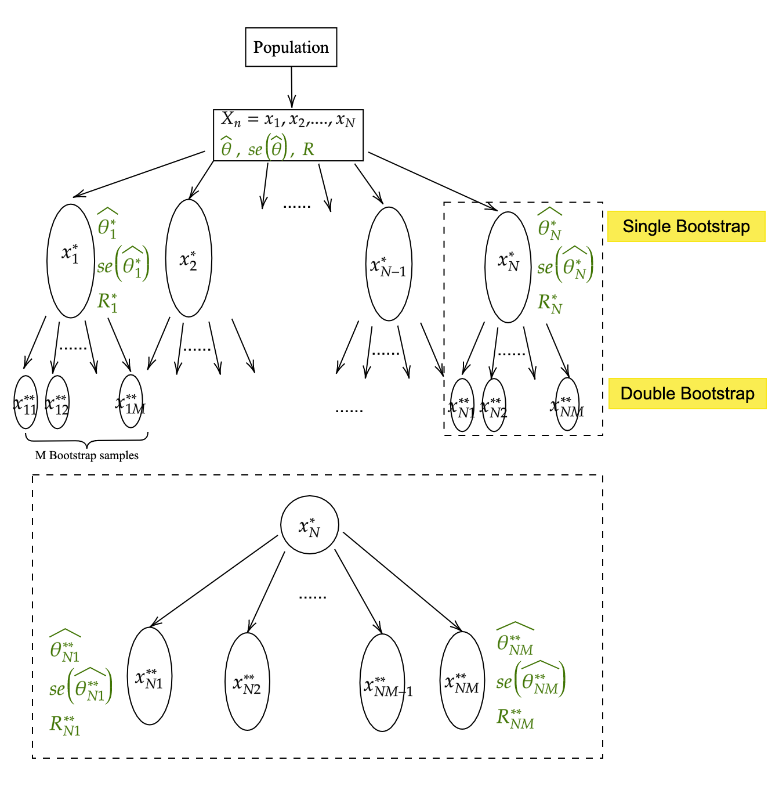

##Single Bootstrap 
$X^*_n=x^*_1,x^*_2,...,x^*_N$, with parameter estimates $\hat{\theta^*_n}$, where $n=1,2,...,N$ .

###Original estimate of $\theta$
$\hat\theta$
```{r eval=FALSE}
est_0 = est_samp_orig$est_samp
```

###Regression on single bootstrap samples to get parameter estimates and SE
```{r eval=FALSE}	
quant_boot_lvl_1 = compute_quants_possibly(df_4_estimate = df_orig[ind_b,]) 
```

###First Stage Root 
$R^*_n= \frac{\hat{\theta^*_n}- \hat{\theta}}{se(\hat{\theta^*_n})}$
```{r eval=FALSE}
root_pivot_0_b = (quant_boot_lvl_1$est_samp-est_0)/quant_boot_lvl_1$se_samp
```

##Double Bootstrap 

$X^{**}_{nm}=x^{**}_11,x^{**}_12,...,x^{**}_{NM}$ with parameter estimates $\hat{\theta^{**}_{nm}}$, where $n=1,2,...,N$ and $m=1,2,...,M$. 
	
###Regression on double bootstrap samples to get parameter estimates and SE
```{r eval=FALSE}
	list_ind_bb_from_b = unlist(list_tib_b_bb[[b]][['ids_bb']],recursive = FALSE)
	
	if(any(is.null(list_ind_bb_from_b))==TRUE){
		u_b=NA
	}else{
	quant_boot_lvl_2 = lapply(list_ind_bb_from_b,FUN=function(xx){
                  	compute_quants_possibly(df_4_estimate =df_orig[unlist(xx),])
														})
	}
		
		est_b_bb = data.frame(do.call(rbind,quant_boot_lvl_2))[,'est_samp']
		se_b_bb = data.frame(do.call(rbind,quant_boot_lvl_2))[,'se_samp']
```

###Second Stage Root
$R^{**}_{nm}= \frac{\hat{\theta^{**}_{nm}} - \hat{\theta^*_n}}{se(\hat{\theta^{**}_{nm}})}$	
```{r eval=FALSE}
	 root_pivot_b_bb = (est_b_bb - quant_boot_lvl_1$est_samp)/se_b_bb
```			

##Probability of roots in second boostrap less then or equal to root in first bootstrap

$Z_n=\frac{Number\,of\,(R^{**}_{nm}\le R^{**}_n)}{M}$
```{r eval=FALSE}
		 u_b = pivot_b  = z_b
		u_b = mean(na.omit(root_pivot_b_bb) <= root_pivot_0_b)
		list_u_all[[b]] = data.frame(u_b=u_b,root_pivot_0_b=root_pivot_0_b)
	
	##After the for loop, we will get a table with columns Z_n and R^*_n
	ref_quants = do.call(rbind,list_u_all)
```

$Z_{[g]}$ with $g=1,2,...,N$: ordered values of $Z_n$
```{r eval=FALSE}
# arrange() ;+ ordered / sort 
ref_quants = ref_quants %>% arrange(u_b) %>% na.omit()
B1_na = nrow(ref_quants)
B1_na

```

$l=N*Z_{[(1-\alpha/2)*N]}$ and $u=N*Z_{[(\alpha/2)*N]}$
```{r eval=FALSE}
l_ref = B1_na*quantile(ref_quants$u_b,(1-alpha/2))
u_ref = B1_na*quantile(ref_quants$u_b,(alpha/2))
```

Use $l$ and $u$ as references to look up in $R^*_{[k]}$ with $k=1,2,...,N$, an ordered list of the N values of $R^*_n$
```{r eval=FALSE}
l_ref_root = ref_quants$root_pivot_0_b[floor(l_ref)]
u_ref_root = ref_quants$root_pivot_0_b[ifelse(floor(u_ref)==0,1,floor(u_ref))]
```

## $100(1-\alpha)\%$ Confidence Interval 

$[\hat{\theta}-R^*_{[l]}*se(\hat{\theta}), \hat{\theta}-R^*_{[u]}*se(\hat{\theta})]$
```{r eval=FALSE}
##lower and upper bound
ll_dtbs_pivot = est_samp_orig$est_samp - l_ref_root*est_samp_orig$se_samp
ul_dtbs_pivot = est_samp_orig$est_samp - u_ref_root*est_samp_orig$se_samp

```
